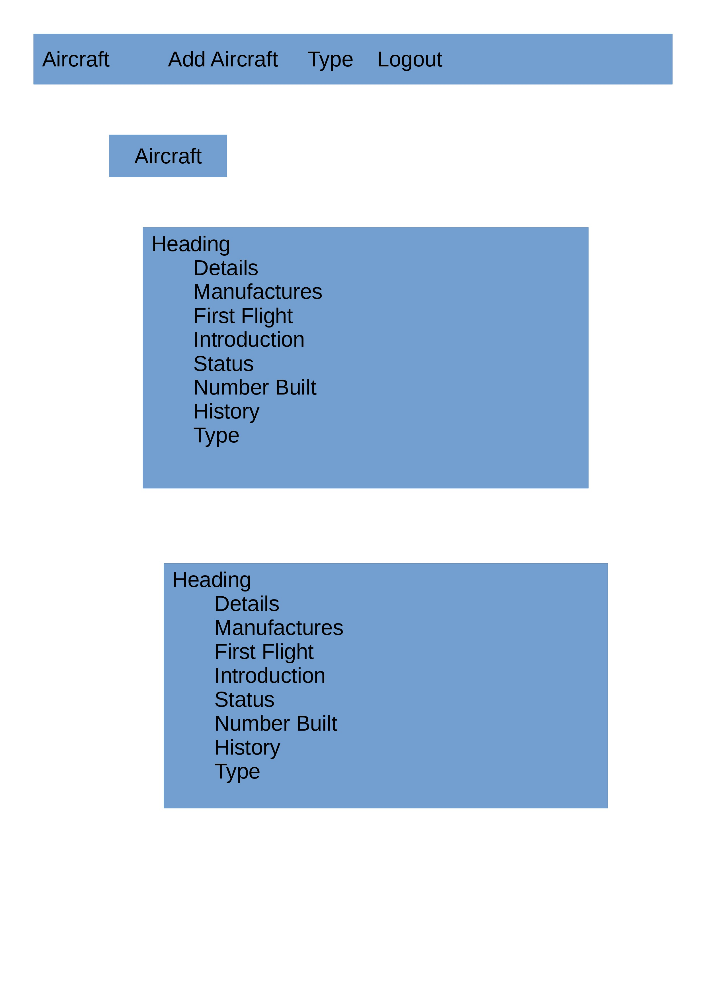
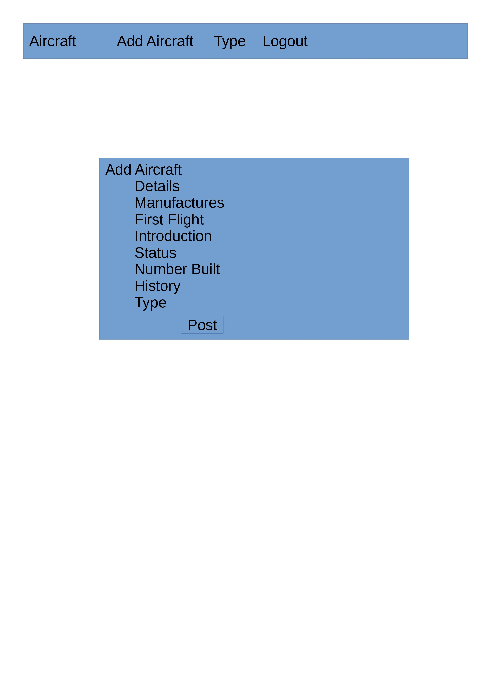
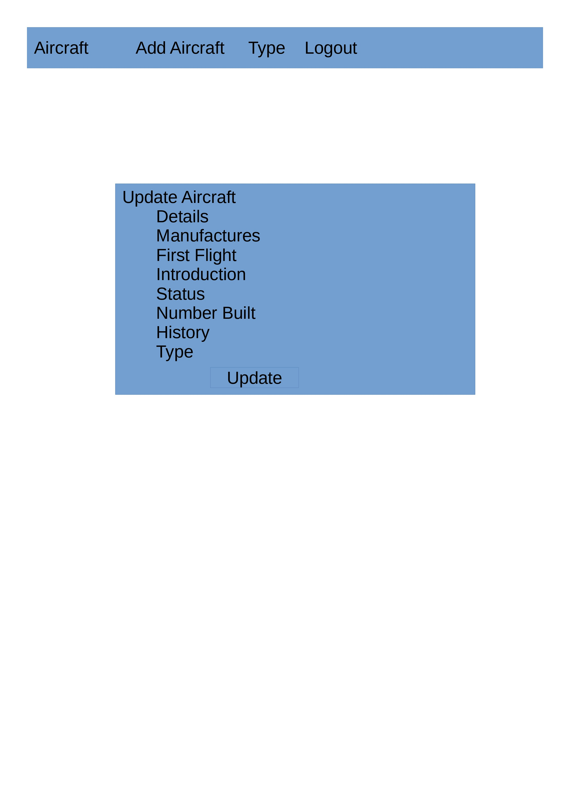

# Overview

This website is a simple site which hol;ds data about aircraft. It is designed to hold basic data about aircraft but it is designed to incorporate many more tables and fields in future.
This phase is just to see if it can be done and is just involved with just background details and the ability to show groups of aircraft based on their role.

## Technology

The technologies used were HTML/CSS/JavaScript, Python and Django.

## The webpages

The site has at present
	### A home page
    
	### An add page for aircraft
    
	### An edit page for aircraft
    
	### A delete aircraft page
	### A type page which displays aircraft of a certain role
	### A login page
	### A register page

## Database Diagram

.jpeg>)

## User stories
1.	The customer requires the website to hold data about aircraft.
2.	The customer needs to have the ability for users to register to be allowed to create or edit details.
3.	 The customer has requested that there is a need to have all the information to be categorised based on their type (role).
4.	The customer requires that the main details are to be ordered by creation date
5.	The customer wants the data to be attractively displayed
6.	The customer wants information about variants, specifications and other data to be displayed.
7. 	The customer wants the history to be edited to display data in a format which can hold rich text.
8.	The customer needs to display photographs and images.

## Testing

Add a user
Add an aircraft
Edit an aircraft
Delete an aircraft
Add a type
Edit a type
Delete a type
All aircraft of a type be displayed in a webpage
User login all data available to be modified
When logged out no data can be changed

## What needs to be done next

	1.Improve the attractiveness of the website by CSS.
	2 Add the ability to show picture
	3.Ensure its responsive
	4 Add specifications table and if needed create more pages.
	5 Add variants table if needed to create more pages.
